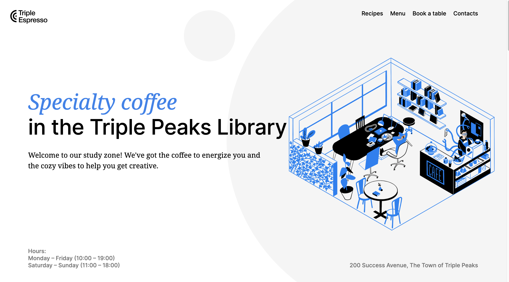
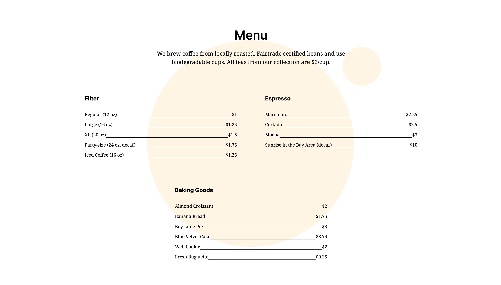

# Triple Peaks Coffee Shop

My second project, it's a coffee shop landing page for Triple Peaks Coffee Shop.

This project utilizes HTML and CSS to bring the design brief to life. The page captures the inviting ambiance and diverse offerings of the coffee shop, with a focus on aesthetic design and user experience.

## Project Features

- Semantic HTML5
- Flexbox
- Positioning
- Flat BEM file structure
- A custom form
- CSS animation and transform

## Project Images

## Plan on improving the project

Once I learn Javascript and React, I want to make this website fully functioned.
